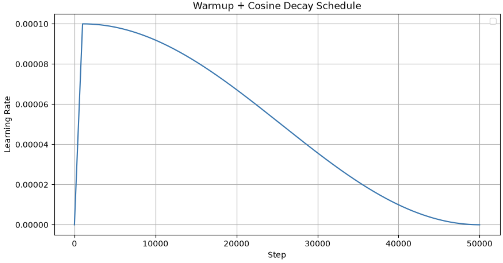

## function get_lr_scheduler
Learning rate warmup function, it creates a PyTorch scheduler that varies the learning rate in 2 phases to stabilize training
The warmup is needed at the very start of the training because : 
- weights are randomly initialized -> gradients can be large/noisy at first
- adam's moving averages (momentum, variance) aren't calibrated yet -> its adaptive updates can be unreliable early on
- a high LR applied too early can cause the model to take huge, unstable steps, sometimes diverging or getting stuck in a bad region

So instead of starting at full LR immediately, we wramp it up gradually from 0, giving the model/optimizer a few steps to settle in before applying the full learning rate.

### Phase 1 Warmup (0 → warmup_steps)
LR increases linearly from 0 to its target value, if we're within the first 1000 steps, the multiplier grows linearly from 0 to 1
Example with warmup_steps=1000 :

    - step 0 → 0/1000 = 0.0 (LR = 0)
    - step 500 → 500/1000 = 0.5 (LR = 50% of target LR = 5e-5)
    - step 999 → 999/1000 ≈ 0.999 (LR ≈ 100%)
    
max(1, warmup_steps) avoids division by zero if warmup_steps=0

### Phase 2 Cosine Decay
LR smoothly decreases toward 0 following a cosine curve, it allows fine convergence toward a minimum, without oscillations near the end of training.
Example with warmup_steps=1000 and total_steps=50000 (so decay happens over 49000 steps): 

    - step 1000  → progress = 0    → 0.5 * (1 + 1)     = 1.0   (100% of LR)
    - step 13250 → progress = 0.25 → 0.5 * (1 + 0.707) ≈ 0.85  (85% of LR)
    - step 25500 → progress = 0.5  → 0.5 * (1 + 0)     = 0.5   (50% of LR)
    - step 37750 → progress = 0.75 → 0.5 * (1 - 0.707) ≈ 0.15  (15% of LR)
    - step 50000 → progress = 1    → 0.5 * (1 - 1)     = 0.0   (0% of LR)

we use cosine because its derivative smoothly approaches zero near both endpoints (0 and 1),avoiding abrupt LR changes that would destabilize training.

